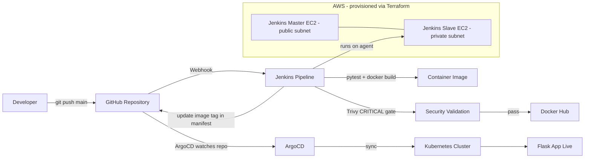

# Flask CI/CD GitOps Platform

A production-style DevOps platform that takes a Python Flask service from a Git commit all the way to a running Kubernetes workload through a fully automated, secured, and auditable path.

> **Delivery path:** GitHub → Jenkins CI (test → build → Trivy gate → push) → Docker Hub → Git manifest update → ArgoCD sync → Kubernetes rollout.


---

## Table of Contents

1. [What This Project Proves](#what-this-project-proves)
2. [Architecture](#architecture)
3. [Tech Stack](#tech-stack)
4. [The 8 Stages](#the-8-stages)
5. [End-to-End Delivery Flow](#end-to-end-delivery-flow)
6. [Replication Walkthrough](#replication-walkthrough)
7. [Evidence Gallery](#evidence-gallery)
8. [Operational Runbook](#operational-runbook)
9. [Known Limitations & Mitigations](#known-limitations--mitigations)
10. [Recruiter / Interview Defense Notes](#recruiter--interview-defense-notes)

---

## What This Project Proves

- I can design and deliver a **full DevOps platform**, not isolated scripts.
- I can provision and operate **AWS infrastructure** using modular Terraform.
- I can configure hosts with **Ansible** using a dynamic EC2 inventory.
- I can build a **secure Jenkins CI pipeline** using a shared-library pattern.
- I can implement **GitOps delivery** with ArgoCD and Kustomize overlays.
- I can validate **runtime posture** (non-root image, probes, resource limits, rollback drills).
- I can **debug real failures** (TLS image-pull issues, Git auth migration, Trivy network timeouts) and document the fixes.

---

## Architecture


A short video demo of the end-to-end flow is included at [`images/Demo Video.mov`](images/Demo%20Video.mov).

### Logical runtime flow



### Why this shape

- **Jenkins owns CI** (commit → tested, scanned artifact). **ArgoCD owns CD** (artifact → cluster). Clean separation of concerns; each side is independently auditable.
- **Git is the single source of truth** for what should run. The pipeline never runs `kubectl apply` against the cluster directly — it commits a manifest change, and ArgoCD reconciles. That makes every deployment a reviewable, revertible commit.
- **The slave lives in a private subnet** and only talks outbound; the master is the controller in the public subnet. Least-privilege network posture.

---

## Tech Stack

| Layer | Implementation | Why |
|---|---|---|
| Application | Python Flask (app-factory pattern) + `/health` endpoint | Lightweight; keeps focus on DevOps, not app complexity |
| Tests | pytest | Standard Python testing; trivial to gate in CI |
| Image build | Docker, `python:3.12-slim`, non-root system user `app`, Gunicorn | Small attack surface; production WSGI server |
| Vulnerability scan | Trivy (CRITICAL gate, `--ignore-unfixed`) | Fast, accurate, low false-positive noise |
| Registry | Docker Hub | Simple public registry for the demo |
| Infrastructure | Terraform modules on AWS (network, security, compute, notifications) | Repeatable, version-controlled infra |
| Host config | Ansible roles + dynamic EC2 inventory | Agentless, idempotent host setup |
| CI | Jenkins declarative pipeline + shared library | Flexible; reusable pipeline steps |
| CD | ArgoCD GitOps application | Declarative, self-healing deployments |
| Orchestration | Kubernetes + Kustomize base/overlays | Industry standard; simple overlay model |
| Alerts | SNS topic with email subscription (Terraform) | Operational notifications on instance state |

---

## The 8 Stages

### Stage 0 — Bootstrap & Repository

**Goal:** Establish the repo, security hygiene, and project structure.

- GitHub repository as the single home for app + infra + CI.
- `.gitignore` excludes secrets and state: `.pem`, `.key`, `.tfstate`, `.tfvars`, `.env`.
- Monorepo layout (app, docker, kubernetes, terraform, ansible, jenkins, argocd, docs).

**Decision — monorepo:** easier to correlate an app change with the infra/manifest change that ships it, and to version the whole platform as one unit.


---

### Stage 1 — Flask Application

**Goal:** A small, testable, observable service.

The app uses the **application-factory pattern** so it can be imported and tested without binding a socket, and exposes a `/health` endpoint for probes:

```python
def create_app() -> Flask:
    app = Flask(__name__)

    @app.route("/")
    def index():
        return render_template("index.html",
            app_name=os.getenv("APP_NAME", "Flask CI/CD GitOps Platform"),
            environment=os.getenv("APP_ENV", "local"))

    @app.route("/health")
    def health():
        return jsonify(status="healthy"), 200

    return app

app = create_app()   # gunicorn imports app:app
```

**Decisions:**
- **Factory pattern** → clean unit testing; no global side effects on import.
- **JSON `/health`** → structured, machine-readable response for Kubernetes liveness/readiness probes.

Tests live in `app/tests/test_app.py` and run as the first quality gate in CI.

---

### Stage 2 — Docker Containerization

**Goal:** Package the app as a minimal, non-root image.

`docker/Dockerfile` highlights:

- Base `python:3.12-slim`.
- Creates a **system user `app`** and runs as that user (`USER app`) — non-root at the image level.
- Installs only `requirements.txt`, copies the app, fixes ownership.
- `HEALTHCHECK` hits `/health` via `urllib`.
- Runs under **Gunicorn** (`2 workers, 4 threads`) rather than the Flask dev server.

```dockerfile
FROM python:3.12-slim
RUN addgroup --system app && adduser --system --ingroup app app
WORKDIR /app
COPY app/requirements.txt /app/requirements.txt
RUN pip install --no-cache-dir -r /app/requirements.txt
COPY app/ /app/
RUN chown -R app:app /app
USER app
EXPOSE 5000
HEALTHCHECK --interval=30s --timeout=3s --start-period=20s --retries=3 \
  CMD python -c "import urllib.request; urllib.request.urlopen('http://127.0.0.1:5000/health')"
CMD ["gunicorn", "--bind", "0.0.0.0:5000", "--workers", "2", "--threads", "4", "--timeout", "60", "app:app"]
```

**Decisions:**
- **Non-root user** → limits blast radius if the container is compromised.
- **Gunicorn over Flask dev server** → the dev server is single-threaded and explicitly not for production.

---

### Stage 3 — Kubernetes (Kustomize base + overlays)

**Goal:** Declarative, multi-environment manifests.

```
kubernetes/
├── base/        namespace, configmap, service, deployment, kustomization
└── overlays/
    ├── dev/     image tag + replicas/resources patch + app_env=dev
    └── prod/    prod-scale patch
```

Base deployment runs **2 replicas**, with **liveness + readiness probes** on `/health` and **resource requests/limits**:

```yaml
livenessProbe:  { httpGet: { path: /health, port: 5000 }, initialDelaySeconds: 10, periodSeconds: 10 }
readinessProbe: { httpGet: { path: /health, port: 5000 }, initialDelaySeconds: 5,  periodSeconds: 5 }
resources:
  requests: { cpu: 100m, memory: 128Mi }
  limits:   { cpu: 500m, memory: 256Mi }
```

The **dev overlay** patches it down to 1 replica, smaller resources, sets the image tag via Kustomize `images:`, and (for local Minikube) `imagePullPolicy: Never`.

**Decisions:**
- **Kustomize over Helm** → no templating language; pure YAML + strategic-merge patches. Simpler and sufficient for one app with a couple of environments.
- **Single source for the image tag** (Kustomize `images:` block) → avoids the reconciliation confusion of two places specifying a tag.
- **Liveness vs readiness** → liveness restarts a hung container; readiness keeps traffic off a pod that isn’t ready yet.


---

### Stage 4 — Terraform Infrastructure (AWS)

**Goal:** Provision the platform as code.

Modular layout under `terraform/`:

| Module | Provisions |
|---|---|
| `network` | VPC, public subnet, private subnet, route tables |
| `security` | Security groups (least-privilege) for master and slave |
| `compute` | Jenkins master (public) and slave (private) EC2 instances |
| `notifications` | SNS topic + email subscription for instance alerts |

`bootstrap/` sets up remote state; `environments/dev/` wires the modules together with `terraform.tfvars`.

**Decisions:**
- **Modules** → reusable, independently reasoned-about units.
- **Master public / slave private** → the slave needs no inbound internet; only the master is the reachable controller.
- **SNS notifications** → operational alerts on instance state without bolting on a separate monitoring stack.


---

### Stage 5 — Ansible Configuration Management

**Goal:** Idempotently turn bare EC2 hosts into a Jenkins master/slave.

```
ansible/
├── inventory/aws_ec2.yml          dynamic EC2 inventory (tag-based)
├── inventory/group_vars/          all / jenkins_master / jenkins_slave
├── playbooks/site.yml
└── roles/  common · java · docker · jenkins-master · jenkins-slave
```

- **Dynamic inventory** discovers EC2 hosts by tag — no hand-maintained host files.
- **Roles** keep concerns separate (common OS setup, Java, Docker, master, slave).
- **Trivy is pre-installed on the slave** so the CI scan stage never depends on a runtime download (see the fix in Stage 8 notes).

**Decision — Ansible on top of Terraform:** Terraform provisions infrastructure; Ansible configures the OS and services on it. Right tool for each layer.


---

### Stage 6 — Jenkins CI Pipeline

**Goal:** Automated test → build → scan → push → manifest update.

The pipeline (`jenkins/Jenkinsfile`) runs on the slave (`agent { label 'slave' }`), triggered by `githubPush()`, with seven stages:

1. **Checkout** — clone source.
2. **Test** — venv + `pytest`.
3. **Build** — `docker build`, tagged with `BUILD_NUMBER`.
4. **Scan** — Trivy gate.
5. **Push** — image to Docker Hub.
6. **Update Manifest** — write the new tag into the dev overlay.
7. **Publish Manifest** — commit + push the manifest change (triggers ArgoCD).

Reusable steps live in a **shared library** (`jenkins/shared-library/vars/`): `buildImage`, `scanImage`, `pushImage`, `updateManifest`, `pushManifest`.

The Trivy gate enforced in CI:

```bash
trivy image --exit-code 1 --severity CRITICAL --ignore-unfixed --no-progress \
  --format table --output trivy-report-<build>.txt ikenna276/flask-app:<build>
```

**Decisions:**
- **`BUILD_NUMBER` as the image tag** → deterministic, easy to correlate with the Jenkins run.
- **CRITICAL + `--ignore-unfixed`** → fail only on vulnerabilities that are both critical and actually patchable, so the gate stays meaningful instead of noisy.
- **Shared library** → DRY pipeline steps, maintained in one place.


---

### Stage 7 — ArgoCD GitOps

**Goal:** Declarative, self-healing continuous delivery.

- `argocd/project.yaml` — an `AppProject` scoping the source repo and the `flask-app` destination namespace.
- `argocd/application.yaml` — an `Application` pointing at `kubernetes/overlays/dev`, with **automated sync, `prune: true`, `selfHeal: true`**.

Flow: Jenkins pushes a manifest commit → ArgoCD detects the change → compares desired (Git) vs actual (cluster) → syncs → Kubernetes performs a rolling update guarded by the probes.

**Decisions:**
- **Auto-sync + self-heal** → drift from Git is corrected automatically; the cluster always matches the repo.
- **Prune** → resources removed from Git are removed from the cluster, so there are no orphans.

> On the “Progressing” health state: a Kubernetes Deployment carries a `Progressing` condition during and shortly after a rollout. ArgoCD surfaces that until the rollout fully settles; it then reports `Healthy`. It’s expected reconciliation behavior, not an error.


---

### Stage 8 — Wiring & Hardening

**Goal:** Move from “working pipeline” to “defensible platform.” Tracked in `docs/STAGE8-HARDENING-CHECKLIST.md`.

What was validated:

- **End-to-end flow** — ArgoCD detects new commits and syncs; the deployment image tag matches the latest Git manifest tag.
- **Secret hygiene** — `git ls-files` confirms no `.pem/.key/.tfstate/.tfvars/.env` are tracked; Jenkins credentials are referenced by ID only.
- **Security gate** — Trivy (v0.71.2 in CI) runs before push and fails on patchable CRITICAL CVEs (validated on real builds).
- **Runtime posture** — non-root image user, readiness/liveness probes present, resource requests/limits present. A live snapshot showed `runAsUser=100` and `allowPrivilegeEscalation=false` on the running container.
- **Rollout & rollback drill** — `rollout status` / `rollout history` / `rollout undo` exercised, including a restore path.
- **Failure runbook** — recovery steps documented for ImagePullBackOff, Argo OutOfSync, and Jenkins agent offline (see [Operational Runbook](#operational-runbook)).

---

## End-to-End Delivery Flow

1. Developer pushes to `main`.
2. GitHub webhook triggers Jenkins.
3. Pipeline: checkout → pytest → docker build → Trivy gate → push to Docker Hub → update overlay tag → commit & push manifest.
4. ArgoCD detects the manifest commit and syncs.
5. Kubernetes rolls out the new image; probes keep the service available.

---

## Walkthrough

### Prerequisites

```bash
# macOS example
brew install --cask docker          # Docker Desktop
brew install kubectl minikube terraform ansible git
```

### 1. Clone

```bash
git clone https://github.com/Ike-DevCloudIQ/flask-cicd-gitops-platform.git
cd flask-cicd-gitops-platform
```

### 2. Run tests locally

```bash
python3 -m venv .venv && source .venv/bin/activate
pip install -r app/requirements-dev.txt
cd app && python -m pytest tests/ -v
```

### 3. Start a local cluster

```bash
minikube start --cpus 4 --memory 8192 --driver docker
kubectl get nodes
```

### 4. Build and load the image

```bash
docker build -t ikenna276/flask-app:dev -f docker/Dockerfile .
minikube image load ikenna276/flask-app:dev
```

### 5. Deploy with Kustomize

```bash
kubectl apply -k kubernetes/overlays/dev
kubectl get all -n flask-app
```

### 6. Access the app

```bash
kubectl port-forward -n flask-app svc/flask-app 5000:80 &
curl http://127.0.0.1:5000/health     # {"status":"healthy"}
open http://127.0.0.1:5000
```

> The `127.0.0.1:5000` URL is your **local Minikube** service via port-forward — not the AWS hosts. The AWS EC2 instances host **Jenkins** (the CI controller), reachable separately at the master’s public IP.

### 7. Install ArgoCD and wire the app

```bash
kubectl create namespace argocd
kubectl apply -n argocd -f https://raw.githubusercontent.com/argoproj/argo-cd/stable/manifests/install.yaml
kubectl wait --for=condition=available --timeout=300s deployment/argocd-server -n argocd

kubectl apply -f argocd/project.yaml
kubectl apply -f argocd/application.yaml

# UI
kubectl port-forward -n argocd svc/argocd-server 8081:443 &
kubectl -n argocd get secret argocd-initial-admin-secret -o jsonpath="{.data.password}" | base64 -d; echo
# open https://localhost:8081  (user: admin)
```

### 8. Provision AWS (optional, for the full CI path)

```bash
cd terraform/bootstrap && terraform init && terraform apply
cd ../environments/dev && terraform init && terraform plan && terraform apply
terraform output      # master public IP, etc.
```

### 9. Configure hosts with Ansible

```bash
cd ansible
ansible-inventory -i inventory/aws_ec2.yml --graph     # confirm discovery
ansible-playbook -i inventory/aws_ec2.yml playbooks/site.yml
```

### 10. Trigger the pipeline

Push any change to `main`; the GitHub webhook starts Jenkins. Watch the build, then Docker Hub, then ArgoCD, then the Kubernetes rollout.

---

## Evidence Gallery

| Evidence | File |
|---|---|
| Architecture diagram | [project-architecture.jpeg](images/project-architecture.jpeg) |
| Demo video | [Demo Video.mov](images/Demo%20Video.mov) |
| Repository structure | [Repository structure i.png](images/Repository%20structure%20i.png) |
| Terraform apply | [Terraform apply.png](images/Terraform%20apply.png) |
| EC2 running | [EC2 running.png](images/EC2%20running.png) |
| EC2 master | [ec2 master.png](images/ec2%20master.png) |
| VPC / Subnets / Route tables | [VPC, Subnets, Route tables.png](images/VPC,%20Subnets,%20Route%20tables.png) |
| Jenkins CI/CD pipeline | [Jenkins : CI:CD pipline.png](images/Jenkins%20:%20CI:CD%20pipline.png) |
| ArgoCD app summary | [Argo : Flask-app summary .png](images/Argo%20:%20Flask-app%20summary%20.png) |
| ArgoCD application detail tree | [ArgoCD Application detail tree.png](images/ArgoCD%20Application%20detail%20tree.png) |
| kubectl resources | [kubectl get.png](images/kubectl%20get.png) |

---

## Operational Runbook

**ImagePullBackOff (local Minikube TLS pull issue)**
The local cluster can fail to pull a freshly pushed public image due to the runtime’s x509 trust chain. Mitigation: load the tag locally.
```bash
bash scripts/sync-minikube-image.sh
kubectl -n flask-app rollout status deploy/flask-app
```

**ArgoCD OutOfSync**
```bash
kubectl get app -n argocd
kubectl -n argocd describe app flask-app-dev      # inspect diff / conditions
# self-heal is on; for a manual nudge, re-sync from the ArgoCD UI/CLI
```

**Rollback a bad deploy**
```bash
kubectl -n flask-app rollout history deploy/flask-app
kubectl -n flask-app rollout undo deploy/flask-app
```

**Jenkins agent offline**
Confirm the slave EC2 is running, the agent service is up, and re-run the Ansible `jenkins-slave` role if tooling drifted.

---

## Known Limitations & Mitigations

These are real, documented limitations of the current scope — not aspirational TODOs:

- **Local image-pull TLS trust** — Minikube on Docker Desktop can fail x509 verification when pulling a new public tag. **Mitigation:** `scripts/sync-minikube-image.sh` loads the tag into Minikube; the deployment then stabilizes.
- **Kubernetes-level non-root enforcement** — the image runs as a non-root system user, and a live container snapshot showed `runAsUser=100` / `allowPrivilegeEscalation=false`. Making an explicit pod/container `securityContext` a permanent part of the base manifest is the identified follow-up.
- **Secrets** — non-secret config is delivered via ConfigMap; the project keeps secrets out of Git and references Jenkins credentials by ID.

---

## My Notes

**Why split CI (Jenkins) from CD (ArgoCD)?**
Different responsibilities. Jenkins turns a commit into a tested, scanned, tagged artifact and records the intent to deploy as a Git commit. ArgoCD reconciles the cluster to Git. The pipeline never touches the cluster directly, so every deploy is a reviewable commit and the cluster self-heals toward Git.

**Why GitOps instead of `kubectl apply` from the pipeline?**
Auditability and recoverability. Every change is a commit (full history, easy `revert`), the cluster can be rebuilt from Git, and drift is corrected automatically. Imperative applies are hard to audit and easy to get wrong.

**Why Kustomize over Helm?**
For one app with a couple of environments, Kustomize’s base + overlay model is simpler — pure YAML and strategic-merge patches, no templating language to learn or debug. Helm earns its complexity when you’re packaging many reusable charts.

**Why a master/slave Jenkins split, master public and slave private?**
Security and scalability. The slave does the builds and needs only outbound access, so it sits in a private subnet. The master is the controller in the public subnet. You can add more agents later without exposing them.

**Why Ansible *and* Terraform?**
They solve different layers. Terraform provisions infrastructure (VPC, subnets, EC2, security groups, SNS). Ansible configures the OS and installs/sets up services on those hosts. Using each for its strength keeps both clean and idempotent.

**Why the `BUILD_NUMBER` image tag and the `CRITICAL --ignore-unfixed` Trivy policy?**
The build number gives a deterministic, traceable tag tied to a specific Jenkins run. The Trivy policy fails only on critical *and patchable* vulnerabilities, so the gate flags real, actionable risk rather than drowning the team in unfixable noise.

**Three real problems I solved (and what they taught me):**
- *Trivy download timed out on the private-subnet slave.* Pre-installed Trivy via Ansible and added retry logic in `scanImage`. Lesson: pre-cache build tools on agents; don’t depend on runtime downloads in constrained networks.
- *Git push for manifest updates failed* after GitHub deprecated password auth. Moved to an SSH deploy key with a token fallback in `pushManifest`. Lesson: prefer keys over passwords, and build a graceful fallback when migrating credentials.
- *ArgoCD sat on “Progressing.”* Root cause was a duplicated image-tag specification plus normal Deployment `Progressing` conditions. Consolidated the tag to a single Kustomize source and confirmed the state resolves to `Healthy`. Lesson: one source of truth per value, and understand what a tool’s status field actually means before “fixing” it.

**How would this go to real production?**
Run on managed Kubernetes (e.g. EKS) instead of local Minikube, add an ingress with TLS termination, move secrets to a sealed/managed store, and layer in metrics/logs/tracing. The pipeline and GitOps model stay exactly the same — only the destination cluster and a few hardening layers change.

**Local vs AWS — where does `127.0.0.1:5000` come from?**
That’s the Flask service on **local Minikube**, reached via `kubectl port-forward`. AWS hosts the **Jenkins CI** controller (master/slave EC2). They’re intentionally separate: the local cluster is the demo deployment target; AWS is the CI plane.

---

## Repository Layout

```
app/            Flask application, tests, requirements
docker/         Dockerfile (non-root, Gunicorn)
kubernetes/     Kustomize base + dev/prod overlays
terraform/      modules (network, security, compute, notifications) + bootstrap + env
ansible/        roles + dynamic EC2 inventory
jenkins/        Jenkinsfile + shared library
argocd/         AppProject + Application
scripts/        sync-minikube-image.sh (local TLS pull workaround)
docs/           hardening checklist + walkthrough
images/         architecture, demo video, evidence screenshots
```

## 👤 Author

**Ikenna Ubah** — DevOps & Platform Engineer

[](https://github.com/Ike-DevCloudIQ)
[](https://www.linkedin.com/in/ikenna2/)

> ⭐ If you found this project useful or insightful, please consider starring the repository.