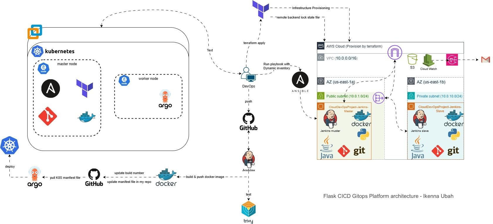
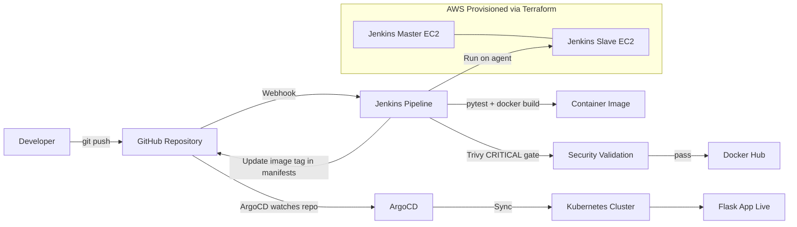

# flask-cicd-gitops-platform

Production-style DevOps/GitOps implementation for a Flask service, designed to demonstrate end-to-end platform engineering skills across infrastructure provisioning, configuration management, secure CI, and Kubernetes continuous delivery.

This project takes code from commit to running workload through a fully automated path:

GitHub -> Jenkins CI (test + build + Trivy gate) -> Docker Hub -> Git manifest update -> ArgoCD sync -> Kubernetes rollout.

## What This Project Proves

- I can design and deliver a full DevOps platform, not just isolated scripts.
- I can provision and operate AWS infrastructure using Terraform modules.
- I can configure and maintain hosts using Ansible with dynamic inventory.
- I can build secure CI pipelines in Jenkins using shared library patterns.
- I can implement GitOps delivery with ArgoCD and Kubernetes Kustomize overlays.
- I can harden and validate runtime posture (non-root, probes, resources, rollback drills).

## Architecture

Attached project architecture:



Logical runtime flow:



## Tech Stack

| Layer | Implementation |
|---|---|
| Application | Python Flask + health endpoint + unit tests |
| Image Build | Docker (non-root runtime user) |
| Vulnerability Scanning | Trivy in CI gate |
| Infrastructure as Code | Terraform modules on AWS |
| Host Configuration | Ansible playbooks + dynamic inventory |
| CI | Jenkins declarative pipeline + shared library |
| CD | ArgoCD GitOps application sync |
| Orchestration | Kubernetes + Kustomize base/overlays |
| Runtime Validation | Probes, resources, rollout history, rollback drill |

## End-to-End Delivery Flow

1. Developer pushes code to GitHub main.
2. Jenkins webhook triggers pipeline.
3. Pipeline stages execute:
   - checkout
   - test (pytest)
   - build image
   - Trivy scan gate (`CRITICAL`, `--ignore-unfixed`)
   - push image to Docker Hub
   - update Kubernetes manifest image tag in repo
   - commit and push updated manifest
4. ArgoCD detects manifest commit and syncs target app.
5. Kubernetes performs rollout to the new image.
6. Service remains available through probe-guarded rollout.

## CI Pipeline Details (Jenkins)

Pipeline is defined in [jenkins/Jenkinsfile](jenkins/Jenkinsfile) and uses shared steps from [jenkins/shared-library](jenkins/shared-library).

Key behavior:

- Build isolation on Jenkins agent node.
- Early failure policy: tests/security gate block promotion.
- Deterministic image tagging using build number.
- Manifest update in Git as single source of truth for deployment.

Security gate command pattern (documented and validated):

```bash
trivy image --exit-code 1 --severity CRITICAL --ignore-unfixed --no-progress ...
```

Reference: [jenkins/README.md](jenkins/README.md)

## Infrastructure (Terraform + AWS)

Terraform provisions platform infrastructure and networking, including:

- VPC and subnet layout
- security groups and routing
- Jenkins compute nodes (master/agent)
- supporting cloud resources used by the platform

Reference: [terraform](terraform)

## Configuration Management (Ansible)

Ansible configures provisioned instances, installs required runtime/tooling, and prepares Jenkins nodes for CI execution.

- Dynamic inventory support
- Role-driven configuration
- Repeatable host bootstrap

Reference: [ansible](ansible)

## Kubernetes + GitOps Delivery

Kubernetes manifests are structured as:

- base resources (namespace, deployment, service)
- environment overlays using Kustomize patches

ArgoCD application definitions in [argocd](argocd) continuously reconcile Git state to cluster state.

Reference documents:

- [kubernetes/README.md](kubernetes/README.md)
- [argocd/README.md](argocd/README.md)

## Security and Hardening Implemented

- No hardcoded secrets in repo; credentials managed in Jenkins.
- CI vulnerability gate enforced before image promotion.
- Kubernetes runtime hardening validated:
  - non-root user execution
  - restricted privilege escalation
  - health probes
  - resource requests/limits
- Operational recovery validated with rollback drills.

Hardening evidence and validation checklist:

- [docs/STAGE8-HARDENING-CHECKLIST.md](docs/STAGE8-HARDENING-CHECKLIST.md)

## Verification and Recruiter Evidence

Evidence pack and capture guides:

- [images/INDEX.md](images/INDEX.md)
- [images/EVIDENCE-GATHERING-GUIDE.md](images/EVIDENCE-GATHERING-GUIDE.md)
- [images/QUICK-CHECKLIST.md](images/QUICK-CHECKLIST.md)

Must-have verification categories covered:

- live application and health check
- Jenkins successful build + Trivy gate proof
- Docker image publish proof
- ArgoCD sync proof
- Kubernetes running workload proof
- AWS infrastructure proof
- rollback and hardening proof

## Project Status

| Stage | Status |
|---|---|
| 0 - Repository bootstrap | Complete |
| 1 - Flask app + tests | Complete |
| 2 - Docker image build | Complete |
| 3 - Kubernetes manifests | Complete |
| 4 - Terraform infrastructure | Complete |
| 5 - Ansible configuration | Complete |
| 6 - Jenkins CI pipeline | Complete |
| 7 - ArgoCD GitOps delivery | Complete |
| 8 - Wiring, hardening, verification | Complete |

## Local Developer Run

```bash
cd app
python -m venv .venv
source .venv/bin/activate
pip install -r requirements-dev.txt
pytest
python app.py
```

App URL: `http://localhost:5000`

## Repository Structure

```text
flask-cicd-gitops-platform/
├── app/                 Flask service + tests
├── docker/              Docker build assets
├── terraform/           AWS IaC modules/environments
├── ansible/             Host configuration automation
├── jenkins/             CI pipeline + shared library
├── kubernetes/          K8s base/overlay manifests
├── argocd/              GitOps app/project definitions
├── scripts/             Operational helpers
├── docs/                Hardening + walkthrough docs
└── images/              Recruiter evidence gallery
```

## Known Constraint and Mitigation

In local Minikube environments, registry TLS trust can intermittently block direct pulls for new tags.

Mitigation implemented:

- pre-load image to Minikube cache
- force `IfNotPresent` pull behavior where needed
- helper script: [scripts/sync-minikube-image.sh](scripts/sync-minikube-image.sh)

## Author

Ikenna Ubah - DevOps and Platform Engineer

- GitHub: https://github.com/Ike-DevCloudIQ
- LinkedIn: https://www.linkedin.com/in/ikenna2/

If this project helped you, a star is appreciated.
